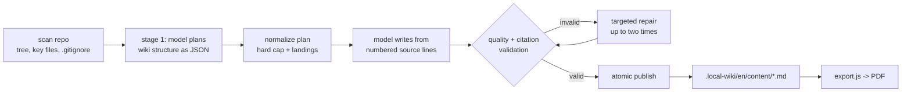

# open-repo-wiki

Generate a **documentation wiki for any repository** using **any AI model you have** —
local or online, fully interchangeable via config profiles — and **export it to PDF**.

Two tools in one package:

| Tool | What it does |
|------|--------------|
| `generate.js` | Analyzes a repo and writes a markdown wiki (with mermaid diagrams) to `.local-wiki/en/content/` |
| `export.js`  | Renders a wiki content folder into styled PDFs (GitHub-like theme, syntax highlighting, rendered mermaid) + one combined `00-COMPLETE-WIKI.pdf` with a table of contents |

The generator works **completely offline** with local backends and has **zero npm
dependencies** (Node ≥ 18, built-in `fetch`). Optional packages unlock the GGUF
provider and the PDF exporter (see [Install](#install)).

## Supported AI backends

| Provider   | What it talks to | Examples |
|------------|------------------|----------|
| `openai`   | any OpenAI-compatible `/chat/completions` API | **local:** Ollama (`:11434/v1`), LM Studio (`:1234/v1`), llama.cpp server (`:8080/v1`), vLLM · **online:** Zhipu GLM, Moonshot Kimi, any OpenAI-style API |
| `ollama`   | native Ollama API (`/api/chat`) | `qwen2.5-coder`, `glm4`, `llama3.1`, ... |
| `llamacpp` | GGUF model loaded **in-process** — no server at all | any `.gguf` file (requires `node-llama-cpp`) |

## Install

```bash
git clone https://github.com/genes8/open-repo-wiki.git
cd open-repo-wiki

# The generator needs NOTHING installed — zero runtime dependencies.
# For the optional features:
npm install                    # everything (PDF export + GGUF provider)
npm install --omit=optional    # explicitly minimal (generator only)
```

Optional packages: `playwright` + `pdf-lib` (PDF export via `export.js`),
`node-llama-cpp` (direct `.gguf` inference via the `llamacpp` provider).

## Quick start

```bash
# 1. Generate a wiki for any repository (offline, local Ollama model):
node generate.js /path/to/your/project

# 2. Export it to PDF:
node export.js /path/to/your/project/.local-wiki/en/content /path/to/your/project/wiki-pdf
```

Switching models is just `--model <profile>` — same repo, same command, different brain:

```bash
node generate.js --list-models                 # see all profiles & key status
node generate.js /path/to/repo -m kimi-api     # online: Moonshot Kimi
node generate.js /path/to/repo -m glm-api      # online: Zhipu GLM (see below)
node generate.js /path/to/repo -m gguf         # direct .gguf, no server
```

## CLI — generate.js

```
node generate.js [repoDir] [options]
  -m, --model <name>    model profile (or REPO_WIKI_MODEL env var)
  -o, --out <dir>       output dir (default <repo>/.local-wiki/en/content)
  -c, --config <file>   config (default: <repo>/repo-wiki.config.json, then ./config.json)
      --pages <substr>  only (re)generate pages whose path contains substring
      --concurrency <n> pages generated in parallel (default: profile `concurrency`, else 1)
      --template <name> `standard` (citations + optional TOC) or `minimal`
                        (grounding citations without TOC guidance)
      --knowledge       also generate semantic module and cross-cutting knowledge cards
      --force           ignore the incremental cache
      --dry-run         show the wiki plan, write nothing
      --list-models     show all profiles and whether API keys are set
```

## CLI — export.js

```
node export.js [sourceDir] [outDir]
  sourceDir   wiki content folder (default ./.qoder/repowiki/en/content)
  outDir      output folder (default ./wiki-pdf)
```

Produces per-page `.pdf` + `.html` previews, an `index.html`, and a combined
`00-COMPLETE-WIKI.pdf` with TOC. Incremental semantics: failed pages keep their
previous output; stale outputs are removed (tracked via `.manifest.json`).

Note: `export.js` loads CSS/JS assets (marked, highlight.js, mermaid) from a CDN
at render time, so the PDF step needs internet access even if the wiki was
generated fully offline.

## Configuration

Profiles live in [config.json](config.json). Put a `repo-wiki.config.json`
in a target repository to override per-project. Profile fields:

```jsonc
{
  "default": "ollama-qwen",           // profile used when --model is omitted
  "language": "en",                   // wiki language
  "maxPages": 20,
  "template": "standard",             // standard or minimal
  "knowledge": false,                 // opt in to the knowledge-card layer
  "models": {
    "my-model": {
      "provider": "openai | ollama | llamacpp",
      "baseUrl": "http://localhost:1234/v1",    // openai/ollama providers
      "model": "model-name",                     // openai/ollama providers
      "apiKey": "env:MY_KEY_VAR",                // literal or env: reference; omit for local
      "modelPath": "/path/model.gguf",           // llamacpp provider only
      "contextSize": 8192,                       // llamacpp/ollama context window
      "gpuLayers": "max",                        // llamacpp provider
      "contextChars": 24000,                     // source-code budget per page prompt
      "maxTokens": 4096,                         // completion cap
      "concurrency": 4,                          // parallel page generation (default 1)
      "temperature": 0.3
    }
  }
}
```

## Using GLM-5.2 (Zhipu cloud API)

Works out of the box — GLM-5.2 is served over an OpenAI-compatible
endpoint with a Bearer API key, exactly what the `openai` provider sends.
Verified against the official Zhipu documentation:

- Endpoint: `https://open.bigmodel.cn/api/paas/v4/chat/completions`
- Auth: `Authorization: Bearer <api-key>`
- Model name: `glm-5.2` · context: 1M tokens · max output: 128K tokens

Setup:

```bash
# 1. Get an API key from the console of your platform:
#    https://bigmodel.cn (China)  or  https://z.ai (international)

# 2. Export it:
export ZHIPU_API_KEY="your-key"

# 3. In config.json, set the model in the glm-api profile:
#    "glm-api": { "model": "glm-5.2", ... }

# 4. Verify the key is picked up (glm-api should show "key: set"):
node generate.js --list-models

# 5. Generate the wiki:
node generate.js /path/to/repo -m glm-api
```

Notes:

- **Platform matters:** keys from `bigmodel.cn` only work on
  `https://open.bigmodel.cn/api/paas/v4`; keys from `z.ai` require
  `"baseUrl": "https://api.z.ai/api/paas/v4"` in the profile instead.
- **Thinking mode:** GLM-5.2 reasons before answering; the final answer
  still arrives in the `content` field, so generation works as-is.
  Thinking does burn tokens and time on long-form writing — where
  supported, sending `"thinking": {"type": "disabled"}` is faster/cheaper.
- **Quota:** the account needs credits or a plan. Free-tier rate limits
  can slow down a 20-page run (the tool retries each call twice).
- **Not offline:** with this profile your repository source is sent to
  Zhipu servers. Use the local profiles for sensitive code.
- With a 1M-token context you can raise `contextChars` (e.g. `200000`)
  so each page prompt carries more of the repository.

## How it works



- **Deterministic plan:** planner paths and source lists are validated against the
  scan. Every final directory with two or more content pages gets exactly one
  landing page, even when the model omitted it. Landings are generated after
  their children, and the final page count never exceeds `maxPages`.
- **Incremental:** `.state.json` stores a generation-schema version and a hash of
  the model/language/template/page metadata plus the raw contents of source files
  actually attached to that page. Unchanged pages are skipped, dropped pages are
  removed, and state changes only after a validated page is atomically published.
  A failed regeneration keeps its previous page and previous hash.
- **Parallel:** set `concurrency` in a profile (or pass `--concurrency N`) to
  generate pages through a worker pool — most useful for online APIs.
- **Grounded:** file paths the model hallucinates in the plan are dropped;
  page prompts contain numbered source lines (budgeted by `contextChars`).
- **Quality-gated:** pages must match their planned H1, bounded depth profile,
  citation requirements, Markdown-fence balance, and landing-child links.
  Refusals, apology/tool-failure text, empty inline code, shallow output, padding,
  and excessive diagrams are rejected. The generator makes up to two targeted
  repair attempts, then reports a non-zero exit without publishing bad output.
- **Reasoning-model safe:** `think: false` is sent to Ollama thinking models
  (with fallback), complete reasoning blocks are stripped only when they occur at
  the beginning of an answer, and literal inline `<think>...</think>` examples
  remain intact. `reasoning_content` is used when a server leaves `content` empty.

### Page depth profiles

Profiles are selected from the normalized page metadata. They bound depth
without forcing a universal section skeleton or a minimum diagram count.

| Profile | H2 sections | Words | Maximum Mermaid diagrams |
|---|---:|---:|---:|
| Landing | 2–4 | 120–700 | 1 |
| Guide/default | 3–6 | 200–1,100 | 1 |
| Overview | 4–7 | 280–1,400 | 2 |
| Architecture/reference | 4–8 | 300–1,600 | 3 |

Unsupported sections and diagrams should be omitted rather than padded.

### Source citations

The top `<cite>` block is a whole-file inventory:

```markdown
- [lib/providers.js](lib/providers.js)
```

`**Section sources**` and `**Diagram sources**` use repository-relative,
line-anchored links:

```markdown
- [lib/providers.js:L11-L23](lib/providers.js#L11-L23)
```

The generator verifies that the file was attached and that
`1 <= start <= end <= actualLineCount`. Malformed, reversed, unattached, and
out-of-bounds ranges are removed and sent back to the repair prompt; ranges are
never silently clamped or invented.

### Knowledge cards

Pass `--knowledge` (or set `"knowledge": true`) to write
`.local-wiki/knowledge/<language>/`. The layer keeps the five module-card kinds,
uses semantic names for common modules such as `lib` → `Core Libraries`, and
adds one evidence-backed card for each detected cross-cutting topic:
configuration, error handling, logging, and dependency management.

Every card has YAML frontmatter containing `kind`, `category`, `name`, `scope`,
and `source_files`. Stable identities remove duplicates before model calls.
`_manifest.json` records generator-managed files; stale managed files are
removed only after a fully successful knowledge pass, while unlisted user files
are preserved.

## Test and smoke test (no model needed)

The authoritative suite uses Node's built-in test runner and an ephemeral local
mock provider:

```bash
npm test
```

For a manual smoke run:

```bash
node test/mock-llm.js &            # fake OpenAI API on :8688
node generate.js /path/to/any/repo -c test/config.json
```

## License

MIT — see [LICENSE](LICENSE).
