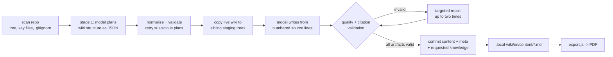

# open-repo-wiki

Generate a **documentation wiki for any repository** using **any AI model you have** —
local or online, fully interchangeable via config profiles — and **export it to PDF**.

Two tools in one package:

| Tool | What it does |
|------|--------------|
| `generate.js` | Analyzes a repo and writes a markdown wiki (with mermaid diagrams) to `.local-wiki/en/content/` |
| `export.js`  | Renders a wiki content folder into styled PDFs (GitHub-like theme, syntax highlighting, rendered mermaid) + one combined `00-COMPLETE-WIKI.pdf` with a table of contents |

The generator works **completely offline** with local backends and has **zero npm
dependencies** (Node ≥ 18, built-in `fetch`). Optional packages unlock the GGUF
provider and the PDF exporter (see [Install](#install)).

## Supported AI backends

| Provider   | What it talks to | Examples |
|------------|------------------|----------|
| `openai`   | any OpenAI-compatible `/chat/completions` API | **local:** Ollama (`:11434/v1`), LM Studio (`:1234/v1`), llama.cpp server (`:8080/v1`), vLLM · **online:** Zhipu GLM, Moonshot Kimi, any OpenAI-style API |
| `ollama`   | native Ollama API (`/api/chat`) | `qwen2.5-coder`, `glm4`, `llama3.1`, ... |
| `llamacpp` | GGUF model loaded **in-process** — no server at all | any `.gguf` file (requires `node-llama-cpp`) |

## Install

```bash
git clone https://github.com/genes8/open-repo-wiki.git
cd open-repo-wiki

# The generator needs NOTHING installed — zero runtime dependencies.
# For the optional features:
npm install                    # everything (PDF export + GGUF provider)
npm install --omit=optional    # explicitly minimal (generator only)
```

Optional packages: `playwright` + `pdf-lib` (PDF export via `export.js`),
`node-llama-cpp` (direct `.gguf` inference via the `llamacpp` provider).

## Quick start

```bash
# 1. Generate a wiki for any repository (offline, local Ollama model):
node generate.js /path/to/your/project

# 2. Export it to PDF:
node export.js /path/to/your/project/.local-wiki/en/content /path/to/your/project/wiki-pdf
```

Switching models is just `--model <profile>` — same repo, same command, different brain:

```bash
node generate.js --list-models                 # see all profiles & key status
node generate.js /path/to/repo -m kimi-api     # online: Moonshot Kimi
node generate.js /path/to/repo -m glm-api      # online: Zhipu GLM (see below)
node generate.js /path/to/repo -m gguf         # direct .gguf, no server
```

## CLI — generate.js

```
Local Repo Wiki generator

Usage: node generate.js [repoDir] [options]

Options:
  -m, --model <name>    model profile from config (default: config "default")
  -o, --out <dir>       output dir (default: <repoDir>/.local-wiki/en/content)
  -c, --config <file>   config file (default: <repoDir>/repo-wiki.config.json,
                        then <appDir>/config.json)
      --pages <substr>  only (re)generate pages whose path contains substring
      --concurrency <n> pages generated in parallel (default: profile/config, else 1)
      --template <name> page template: "standard" (citations + TOC) or "minimal"
      --knowledge       also generate the structured knowledge-card layer
      --force           regenerate everything, ignore the incremental cache
      --dry-run         print the wiki plan and exit without writing pages
      --prune           delete managed pages omitted by a successful,
                        non-regressive full plan
      --accept-plan-shrink
                        accept a regressive plan and delete omitted managed pages
      --json-events     machine mode: NDJSON events on stdout instead of human logs
      --modify <path>   modify an existing page (see --op); pairs with --instruction
      --op <name>       operation for --modify: modify | supplement | rewrite
      --instruction <text>
                        instruction describing the desired change (required with --modify)
      --list-models     list configured model profiles and exit
  -h, --help            show this help

Environment: REPO_WIKI_MODEL overrides the default model profile.
```

Deletion is opt-in. A normal successful run keeps previously managed pages that
the newest plan omits and keeps them in the catalog/index. Use `--prune` only
when the new full plan should replace that retained set. Use
`--accept-plan-shrink` when a deliberate large plan reduction should bypass the
regression gate and remove omitted pages. `--pages` cannot be combined with
either deletion flag because a selective run cannot prove that other pages are
stale.

The default structured output keeps metadata, knowledge, and diagnostics under
the repository's `.local-wiki/` root. For a flat custom path such as
`--out /tmp/wiki-out`, the catalog remains in the direct sibling
`/tmp/meta/` (for exporter compatibility), while diagnostics and knowledge are
isolated under `/tmp/wiki-out.local-wiki/`; they are never derived as `/runs`
or `/knowledge`.

## CLI — export.js

```
node export.js [sourceDir] [outDir]
  sourceDir   wiki content folder (default ./.qoder/repowiki/en/content)
  outDir      output folder (default ./wiki-pdf)
```

Produces per-page `.pdf` + `.html` previews, an `index.html`, and a combined
`00-COMPLETE-WIKI.pdf` with TOC. Incremental semantics: failed pages keep their
previous output; stale outputs are removed (tracked via `.manifest.json`).

Note: `export.js` loads CSS/JS assets (marked, highlight.js, mermaid) from a CDN
at render time, so the PDF step needs internet access even if the wiki was
generated fully offline.

## Configuration

Profiles live in [config.json](config.json). Put a `repo-wiki.config.json`
in a target repository to override per-project. Profile fields:

```jsonc
{
  "default": "ollama-qwen",           // profile used when --model is omitted
  "language": "en",                   // wiki language
  "maxPages": 20,
  "template": "standard",             // standard or minimal
  "knowledge": false,                 // opt in to the knowledge-card layer
  "models": {
    "my-model": {
      "provider": "openai | ollama | llamacpp",
      "baseUrl": "http://localhost:1234/v1",    // openai/ollama providers
      "model": "model-name",                     // openai/ollama providers
      "apiKey": "env:MY_KEY_VAR",                // literal or env: reference; omit for local
      "modelPath": "/path/model.gguf",           // llamacpp provider only
      "contextSize": 8192,                       // llamacpp/ollama context window
      "gpuLayers": "max",                        // llamacpp provider
      "contextChars": 24000,                     // source-code budget per page prompt
      "maxTokens": 4096,                         // completion cap
      "retries": 2,                              // provider retries per request
      "concurrency": 4,                          // parallel page generation (default 1)
      "temperature": 0.3
    }
  }
}
```

## Wiki plan file

Optionally commit a `wiki_plan.yaml` (or `wiki_plan.json`) at the repo root to
pin the page list, inject guidance notes, pick a template preset, and constrain
source files with gitignore-style scope globs. See
[wiki-plan.schema.md](wiki-plan.schema.md) for the full schema, examples, and
strict-parser limitations.

## Editing the wiki

Pages the generator publishes are protected from being silently clobbered by a
later run. Two independent hashes are tracked per page:

- **Source hash** (`state.pages[path]`) — the model/language/template/page
  metadata plus the raw contents of every source file attached to the page.
- **Output hash** (`pageMetadata[path].outputHash`) — the published markdown as
  last written by the generator.

If a human edits a published page, the output hash no longer matches, so a later
run reports `protected: externally-modified`, skips the page, and never
overwrites the edit — even when the underlying source files changed or the code
drifted. A page marked `curated` (see below) is likewise skipped as
`protected: curated`. Protected pages are retained in the catalog/index.

`--force` overrides both protections: it regenerates every page (or the matching
`--pages` subset) and overwrites the manual edits.

Three edit operations are available on an already-generated wiki:

```bash
node generate.js /path/to/repo --modify guides/getting-started.md \
  --op modify --instruction "Update the Node version in the setup section"

node generate.js /path/to/repo --modify guides/getting-started.md \
  --op supplement --instruction "Add a troubleshooting section"

node generate.js /path/to/repo --modify guides/getting-started.md \
  --op rewrite --instruction "Restructure around a quick-start-first flow"
```

- `modify` — change only what the instruction asks; keep structure, headings,
  and style.
- `supplement` — append new content; never delete or rewrite existing sections.
- `rewrite` — produce a fresh full rewrite of the page, restructuring allowed.

`--modify` resolves the page against the published catalog (exact path, then a
unique substring), rewrites it through the same quality/citation validation as
generation, and marks the page `curated: true` so future runs protect it. The
rewrite commits atomically together with the refreshed catalog. A `modify` run
still requires the model profile and a prior successful generation.

In `catalog.json`, each page carries a `protected` flag, set when the page is
`curated` (edited via `--modify`) or `externallyModified` (hand-edited since the
last generator write).

## Programmatic API + events

Everything the CLI does is available via `lib/api.js` as Promise-based
functions that emit typed events:

```js
const { generateWiki, modifyWiki, ApiError } = require('./lib/api');

// Tap events; the same vocabulary is emitted as NDJSON via --json-events.
await generateWiki('/path/to/repo', { model: 'ollama-qwen' }, (event) => {
  if (event.type === 'page_done') console.log(`${event.path} ${event.status}`);
});
```

Exports: `generateWiki`, `modifyWiki`, `ApiError`, `loadConfig`, `loadDotenv`,
`pickProfile`, `listModels`, `GENERATION_SCHEMA_VERSION`. Options accept the CLI
flag names (`model`, `out`, `config`, `pages`, `concurrency`, `template`,
`knowledge`, `force`, `dryRun`, `prune`, `acceptPlanShrink`) or their camelCase
programmatic forms (`configPath`, `dryRun`, ...).

Every event has `type` and `ts` (ISO-8601 timestamp added by the bus). The full
vocabulary:

| Event | Payload fields |
|---|---|
| `run_started` | `repo`, `model`, `provider`, `modelId`, `configPath`, `outDir`, `mode?` |
| `env_loaded` | `count` |
| `scan_started` | — |
| `scan_done` | `files` |
| `plan_file_loaded` | `file`, `documents`, `scope{include,exclude}` |
| `scan_warning` | `message` |
| `run_note` | `message` |
| `plan_started` | — |
| `plan_retry` | `attempt`, `codes` |
| `plan_ready` | `pages[{path,title}]`, `coverage`, `strict?` |
| `dry_run` | — |
| `page_start` | `path` |
| `page_retry` | `path`, `attempt`, `codes` |
| `page_note` | `path`, `message` |
| `page_done` | `path`, `status` (`generated`\|`degraded`\|`protected`\|`skipped`), `chars?`, `files?`, `reason?`, `codes?` |
| `page_fail` | `path`, `message` |
| `stale_removed` | `path` |
| `catalog_written` | `metaDir` |
| `knowledge_started` | — |
| `knowledge_card_fail` | `path`, `message` |
| `knowledge_done` | `generated`, `duplicates`, `removed`, `dir` |
| `knowledge_failed_run` | `failed` |
| `run_aborted` | `ok`, `skipped`, `failed`, `subject` |
| `run_finished` | `stats{generated,degraded,skipped,failed,knowledgeFailed}`, `outDir`, `tip` |
| `run_error` | `code`, `message` |
| `cleanup_warning` | `target`, `message` |
| `model_profile` | `name`, `default`, `provider`, `model` |

`ApiError` carries a stable `code` (`bad_config`, `unknown_model`, `bad_args`,
`no_files`, `bad_plan_file`, `empty_scope`, `plan_failed`, `page_failures`,
`knowledge_failures`, `no_wiki`, `unknown_page`, `modify_validation`, ...); the
CLI maps it to a non-zero exit code.

## Using GLM-5.2 (Zhipu cloud API)

Works out of the box — GLM-5.2 is served over an OpenAI-compatible
endpoint with a Bearer API key, exactly what the `openai` provider sends.
Verified against the official Zhipu documentation:

- Endpoint: `https://open.bigmodel.cn/api/paas/v4/chat/completions`
- Auth: `Authorization: Bearer <api-key>`
- Model name: `glm-5.2` · context: 1M tokens · max output: 128K tokens

Setup:

```bash
# 1. Get an API key from the console of your platform:
#    https://bigmodel.cn (China)  or  https://z.ai (international)

# 2. Export it:
export ZHIPU_API_KEY="your-key"

# 3. In config.json, set the model in the glm-api profile:
#    "glm-api": { "model": "glm-5.2", ... }

# 4. Verify the key is picked up (glm-api should show "key: set"):
node generate.js --list-models

# 5. Generate the wiki:
node generate.js /path/to/repo -m glm-api
```

Notes:

- **Platform matters:** keys from `bigmodel.cn` only work on
  `https://open.bigmodel.cn/api/paas/v4`; keys from `z.ai` require
  `"baseUrl": "https://api.z.ai/api/paas/v4"` in the profile instead.
- **Thinking mode:** GLM-5.2 reasons before answering; the final answer
  still arrives in the `content` field, so generation works as-is.
  Thinking does burn tokens and time on long-form writing — where
  supported, sending `"thinking": {"type": "disabled"}` is faster/cheaper.
- **Quota:** the account needs credits or a plan. Free-tier rate limits
  can slow down a 20-page run (the tool retries each call twice).
- **Not offline:** with this profile your repository source is sent to
  Zhipu servers. Use the local profiles for sensitive code.
- With a 1M-token context you can raise `contextChars` (e.g. `200000`)
  so each page prompt carries more of the repository.

## How it works


```mermaid
graph LR
  A[scan repo<br/>tree, key files, .gitignore] --> B[stage 1: model plans<br/>wiki structure as JSON]
  B --> C[normalize + validate<br/>retry suspicious plans]
  C --> D[copy live wiki to<br/>sibling staging trees]
  D --> E[model writes from<br/>numbered source lines]
  E --> F{quality + citation<br/>validation}
  F -->|invalid| G[targeted repair<br/>up to two times]
  G --> F
  F -->|all artifacts valid| H[commit content + meta<br/>+ requested knowledge]
  H --> I[.local-wiki/en/content/*.md]
  I --> J[export.js -> PDF]
```

- **Deterministic plan:** planner paths and source lists are validated against the
  scan. Every final directory with two or more content pages gets exactly one
  landing page, even when the model omitted it. Landings are generated after
  their children, singleton directories and one-child landings are rejected,
  and the final page count never exceeds `maxPages`. Compared with the last
  successful plan, losing more than 25% of pages or any previously covered key
  topic triggers a planner repair; three rejected plans abort before staging.
- **Transactional:** content, catalog/index/state, and requested knowledge cards
  are built in sibling staging trees. They become live only after every planned
  page and knowledge card succeeds. A page, card, derived-output, or commit
  failure removes the stages and restores any renamed live trees, so a failed
  run cannot partially publish or perform stale cleanup.
- **Incremental:** schema-3 `.state.json` stores source-backed page hashes,
  published metadata, the last successful normalized plan, and the last
  committed run ID. The hash includes
  the model/language/template/page metadata plus the raw contents of source files
  actually attached to that page. Unchanged pages are skipped. Omitted pages are
  retained by default and are deleted only with `--prune` or
  `--accept-plan-shrink`; state changes become live only with the complete
  transaction.
- **Parallel:** set `concurrency` in a profile (or pass `--concurrency N`) to
  generate pages through a worker pool — most useful for online APIs.
- **Grounded:** file paths the model hallucinates in the plan are dropped;
  page prompts contain numbered source lines (budgeted by `contextChars`).
- **Quality-gated:** pages must match their planned H1, bounded depth profile,
  citation requirements, Markdown-fence balance, and landing-child links.
  Refusals, apology/tool-failure text, empty inline code, shallow output, padding,
  excessive diagrams, provider token-limit completions, incomplete final
  sections, and shell commands absent from the prompt-visible attached source
  are rejected. The generator makes up to two targeted repair attempts, then
  reports a non-zero exit without publishing any part of the run.
- **Reasoning-model safe:** `think: false` is sent to Ollama thinking models
  (with fallback), complete reasoning blocks are stripped only when they occur at
  the beginning of an answer, and literal inline `<think>...</think>` examples
  remain intact. `reasoning_content` is used when a server leaves `content` empty.

### Page depth profiles

Profiles are selected from the normalized page metadata. They bound depth
without forcing a universal section skeleton or a minimum diagram count.

| Profile | H2 sections | Words | Maximum Mermaid diagrams |
|---|---:|---:|---:|
| Landing | 2–4 | 120–700 | 1 |
| Guide/default | 3–6 | 200–1,100 | 1 |
| Overview | 4–7 | 280–1,400 | 2 |
| Architecture/reference | 4–8 | 300–1,600 | 3 |

Unsupported sections and diagrams should be omitted rather than padded.

### Source citations

The top `<cite>` block is a whole-file inventory:

```markdown
- [lib/providers.js](lib/providers.js)
```

`**Section sources**` and `**Diagram sources**` use repository-relative,
line-anchored links:

```markdown
- [lib/providers.js:L11-L23](lib/providers.js#L11-L23)
```

The generator verifies that the file was attached and that
`1 <= start <= end <= actualLineCount`. Malformed, reversed, unattached, and
out-of-bounds ranges are removed and sent back to the repair prompt; ranges are
never silently clamped or invented.

### Run diagnostics

Every standard-layout run writes a durable audit trail outside the publication
transaction:

```text
.local-wiki/runs/<run-id>/
  run.json
  plan/attempt-1.raw.txt
  plan/attempt-1.json
  plan/accepted.normalized.json
  pages/<page-path>/attempt-1.md
  pages/<page-path>/attempt-1.json
  knowledge/<card-path>/attempt-1.md
  knowledge/<card-path>/attempt-1.json
```

With a flat custom `--out <dir>`, the same `runs/` tree lives under
`<dir>.local-wiki/`.

Rejected retries remain available after an abort. Attempt metadata includes the
provider/model, API `finish_reason`, token usage when supplied, deterministic
violation codes, page statistics, and accepted/rejected status. `run.json`
finishes as `committed`, `aborted`, or `dry-run`. Prompts, API keys,
authorization headers, `.env` contents, and full attached source blocks are not
stored.

### Knowledge cards

Pass `--knowledge` (or set `"knowledge": true`) to write
`.local-wiki/knowledge/<language>/`. The layer keeps the five module-card kinds,
uses semantic names for common modules such as `lib` → `Core Libraries`, and
adds one evidence-backed card for each detected cross-cutting topic:
configuration, error handling, logging, and dependency management.

Every card has YAML frontmatter containing `kind`, `category`, `name`, `scope`,
and `source_files`. Stable identities remove duplicates before model calls.
`_manifest.json` records generator-managed files; stale managed files are
removed only inside the staged tree after a fully successful knowledge pass,
while unlisted user files are preserved. Knowledge output commits in the same
transaction as content and metadata.

## Test and smoke test (no model needed)

The authoritative suite uses Node's built-in test runner and an ephemeral local
mock provider:

```bash
npm test
```

For a manual smoke run:

```bash
node test/mock-llm.js &            # fake OpenAI API on :8688
node generate.js /path/to/any/repo -c test/config.json
```

## License

MIT — see [LICENSE](LICENSE).
